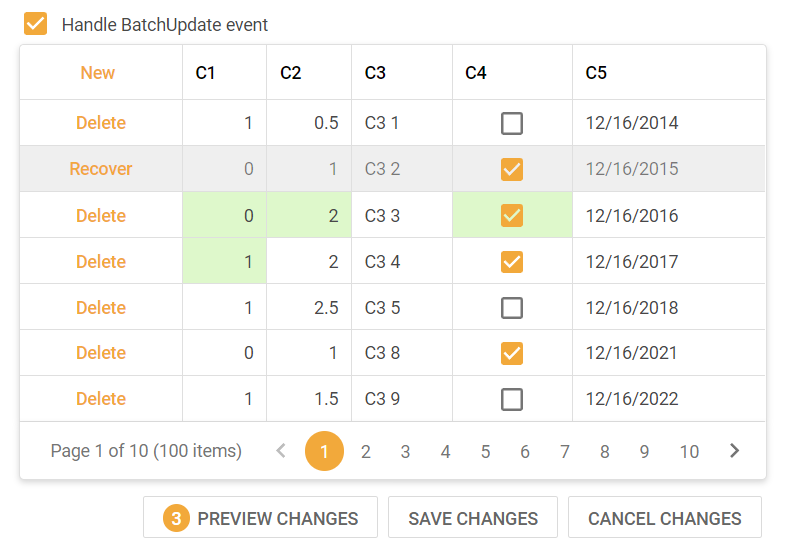

<!-- default badges list -->

<!-- default badges end -->

# Grid View for ASP.NET Web Forms - A simple batch editing implementation

<!-- run online -->

**[[Run Online]](https://codecentral.devexpress.com/128532752/)**

<!-- run online end -->

This example demonstrates how to use the [ASPxGridView](https://docs.devexpress.com/AspNet/DevExpress.Web.ASPxGridView) control's batch edit mode events to update a custom object data source stored in the session.

When a Grid View is bound to an object data source at runtime, you need to implement the CRUD logic required to edit data. To do this, use one of the following options:

- Handle the ASPxGridView's [RowInserting](https://docs.devexpress.com/AspNet/DevExpress.Web.ASPxGridView.RowInserting), [RowUpdating](https://docs.devexpress.com/AspNet/DevExpress.Web.ASPxGridView.RowUpdating), and [RowDeleting](https://docs.devexpress.com/AspNet/DevExpress.Web.ASPxGridView.RowDeleting) events.

  This technique allows you to handle each CRUD operation type in a separate event handler.

- Handle the [BatchUpdate](https://docs.devexpress.com/AspNet/DevExpress.Web.ASPxGridBase.BatchUpdate) event.

  Use this technique to process all operations in a single handler.

 

## Files to Look At

- [Default.aspx](./CS/WebSite/Default.aspx) (VB: [Default.aspx.vb](./VB/WebSite/Default.aspx.vb))
- [Default.aspx.cs](./CS/WebSite/Default.aspx.cs) (VB: [Default.aspx.vb](./VB/WebSite/Default.aspx.vb))

## Documentation

- [Batch Edit Mode](https://docs.devexpress.com/AspNet/16443/components/grid-view/concepts/edit-data/batch-edit-mode)
- [Troubleshooting: Why the 'Specified method is not supported' and 'Updating is not supported by data source 'X' unless UpdateCommand is specified' errors occur](https://docs.devexpress.com/AspNet/403771/troubleshooting/grid-related-issues/crud-operations-with-custom-data-source)

## More Examples

- [Grid View for ASP.NET Web Forms - Prevent a batch edit action](https://github.com/DevExpress-Examples/aspxgridview-prevent-batch-edit-action)
- [Grid View for ASP.NET Web Forms - Editing an in-memory dataset](https://github.com/DevExpress-Examples/aspxgridview-edit-in-memory-dataset)
